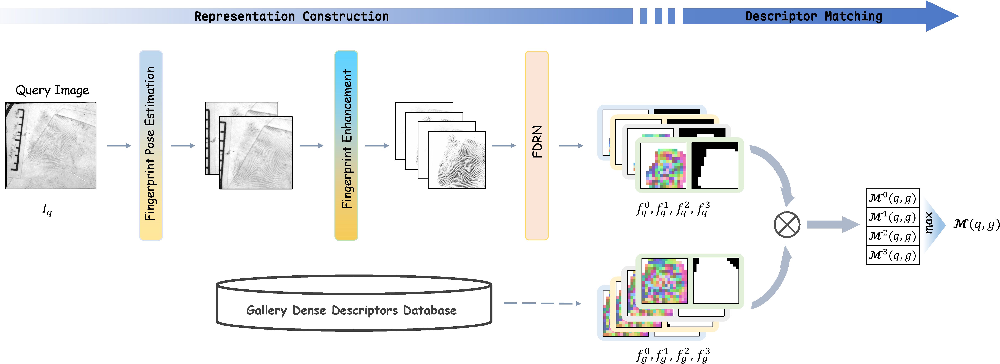

<div align="center">

# FLARE: Fixed-Length Dense Fingerprint Representation 

**Fixed-Length Dense Fingerprint Representation With Alignment and Robust Enhancement With Alignment and Robust Enhancement**

[](https://ieeexplore.ieee.org/abstract/document/11367048)
[](https://ieeexplore.ieee.org/xpl/RecentIssue.jsp?punumber=10206)
[](https://www.tsinghua.edu.cn/)
[](#-license--usage-notice)

[**Zhiyu Pan**](https://github.com/Yu-Yy), [**Xiongjun Guan**](https://github.com/XiongjunGuan), **Yongjie Duan**, **Jianjiang Feng**, and **Jie Zhou**

**Department of Automation, Tsinghua University**

---

<p align="center">
  
</p>

</div>

## 🔍 Overview

**FLARE** is a comprehensive fingerprint recognition framework designed for robust and efficient matching. It introduces a **Fixed-length Dense Descriptor (FDD)**, which is an extension and enhancement of our previous work: *[Fixed-length Dense Descriptor for Efficient Fingerprint Matching](https://ieeexplore.ieee.org/abstract/document/10810702)* (WIFS 2024, Best Student Paper Awards).

The framework integrates three core pillars:
- 🧠 **Dense Descriptor (FDD)**: Extracting highly discriminative fixed-length features.
- 🧩 **Pose-Aware Alignment**: Accurate orientation and center estimation via Regression and Voting strategies.
- 🧪 **Robust Enhancement**: Improving image quality in low-SNR scenarios (e.g., latent fingerprints).

---

## 📦 Project Structure & Modules

| Module | Description | Implementation / Link |
| :--- | :--- | :--- |
| **FLARE-Enh** | Fingerprint enhancement (UNetEnh, PriorEnh) | [Yu-Yy/FLARE_ENH](https://github.com/Yu-Yy/FLARE_ENH) |
| **FLARE-Align** | Multi-strategy Pose Estimation (Regression & Voting) | Included in this Repo |
| **FLARE-Desc** | Fixed-length Dense Descriptor (FDD) extraction | Included in this Repo |

---

## 🛠️ Environment Setup

We recommend using a standard Python environment with the following dependencies:

```bash
# Core Requirements
torch >= 1.10
numpy, opencv-python, scipy, Pillow
tqdm, PyYAML, easydict, pandas

```

---

## 📥 Model Weights

Before running the scripts, please download the pre-trained models and place them in the `model_weights/` directory:

* **FDD Model**: [[Link to Model](https://drive.google.com/file/d/1zvAI57L0TDC7q6kQgNh5_DwSbicjJ4hs/view?usp=drive_link)]
* **RegressionPose Model**: [[Link to Model](https://drive.google.com/file/d/1AXpN8GBSqhlIXDilqPLfZf9n4Dc0pEpj/view?usp=drive_link)]
* **VotingPose Model**: [[Link to Model](https://drive.google.com/file/d/1Zg4duNJ8mg-fkTACTzpPPK7DgNb9NRvA/view?usp=drive_link)]

---

## 🚀 Usage Guide

### 1. Data Preparation

Organize your dataset (e.g., NIST_SD4 or custom data) in the following structure:

```text
your_dataset_name/
├── image/
│   ├── query/        # Query fingerprints (any image format)
│   │   └── xxxx.png
│   └── gallery/      # Reference or gallery fingerprints
│       └── yyyy.png

```

### 2. Pose Estimation (Alignment)

We provide two strategies for fingerprint pose estimation. Specify the dataset path with `-f` and GPU ID with `-g`.

* **Voting-based Pose Estimation:**
```bash
python extract_VotingPose.py -f /path/to/your_dataset -g 0
```


* **Regression-based Pose Estimation:**
```bash
python extract_RegressionPose.py -f /path/to/your_dataset -g 0
```

### 3. Feature Extraction (FDD)

Extract the fixed-length dense descriptors. You can choose which pose result to use for alignment via the `-p` argument.

```bash
# Using VotingPose results
python extract_FDD.py -f /path/to/your_dataset -g 0 -p VotingPose

# Enable binary feature matching (optional)
python extract_FDD.py -f /path/to/your_dataset -g 0 -p RegressionPose -b

```

* `-p`: Specifies the pose estimation source (`VotingPose` or `RegressionPose`).
* `-b`: Enables binary representation for ultra-fast matching.

---

## 📄 Citation

If you find our work useful in your research, please cite:

```bibtex
@ARTICLE{pan2025flare,
  author={Pan, Zhiyu and Guan, Xiongjun and Duan, Yongjie and Feng, Jianjiang and Zhou, Jie},
  journal={IEEE Transactions on Information Forensics and Security}, 
  title={Fixed-Length Dense Fingerprint Representation With Alignment and Robust Enhancement}, 
  year={2026},
  volume={21},
  pages={1751-1765},
}

@INPROCEEDINGS{pan2024fdd,
  author={Pan, Zhiyu and Duan, Yongjie and Feng, Jianjiang and Zhou, Jie},
  booktitle={2024 IEEE International Workshop on Information Forensics and Security (WIFS)}, 
  title={Fixed-length Dense Descriptor for Efficient Fingerprint Matching}, 
  year={2024},
  volume={},
  number={},
  pages={1-6},
}
```

## ⚠️ License

This project is released under the **Academic Research License**. It is provided for academic and educational use only; **commercial use is strictly prohibited**.

## 📬 Contact

For technical issues or collaboration, please reach out to:
**Zhiyu Pan** (pzy20@mails.tsinghua.edu.cn)

For research collaboration or other inquiries, please contact the corresponding authors:
**Jianjiang Feng** (jfeng@tsinghua.edu.cn)